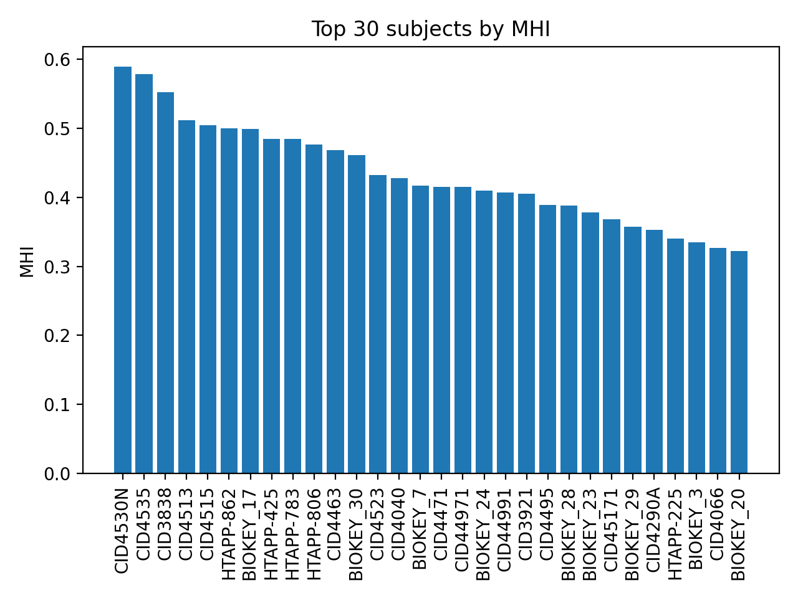
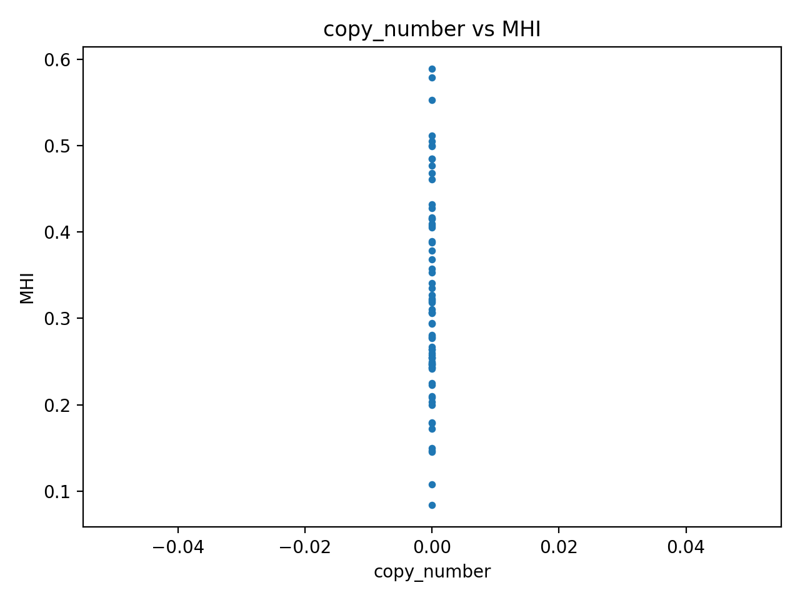
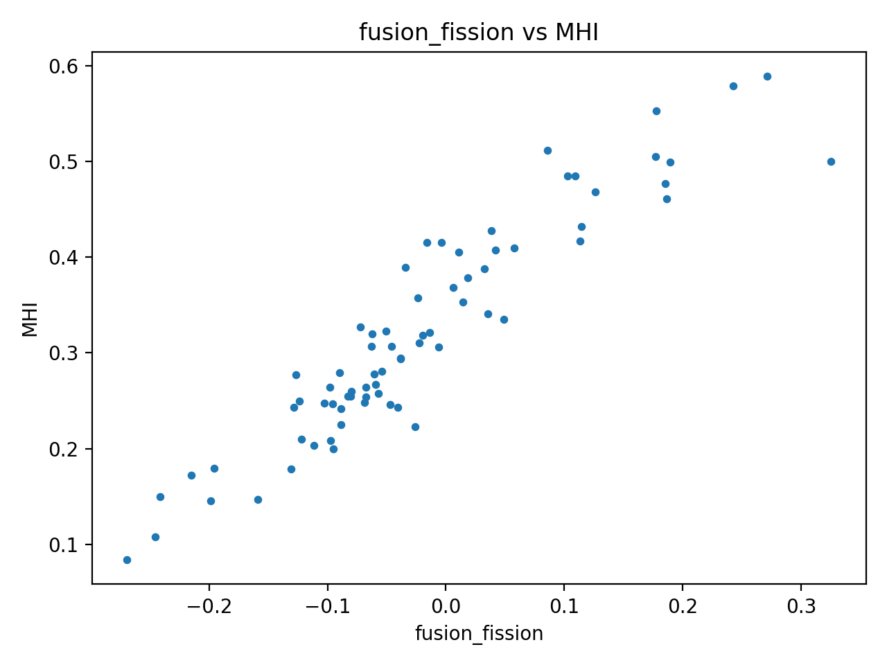
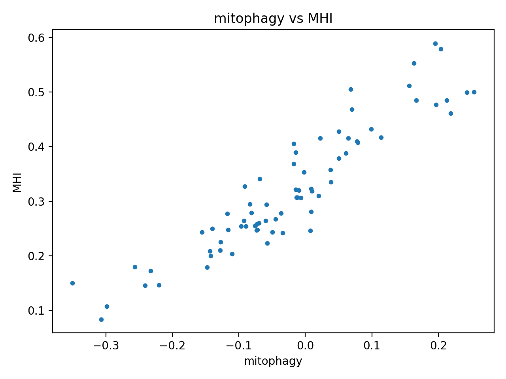
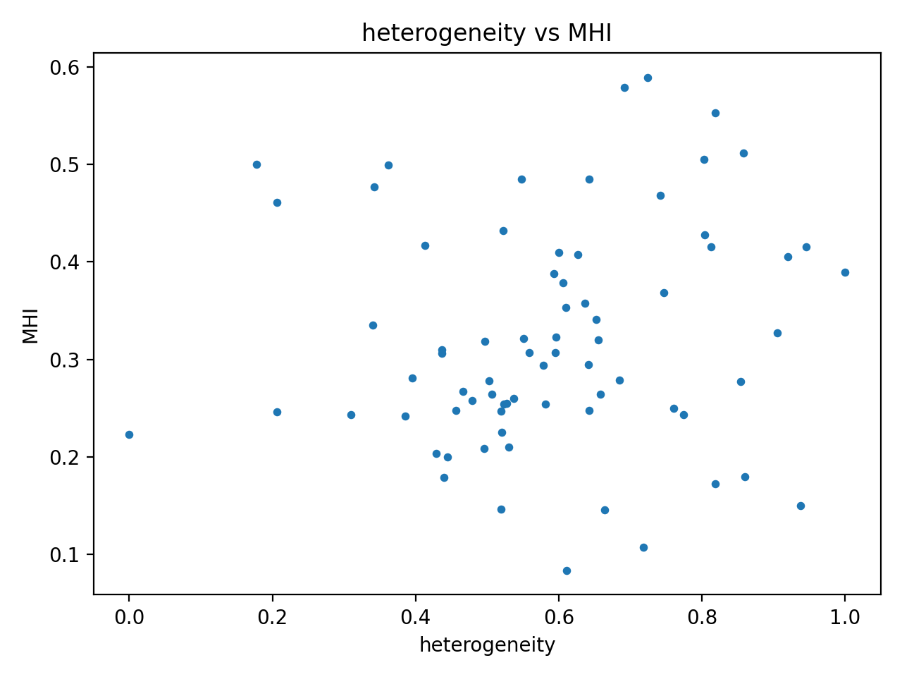

# MitoOmics-GPU Report

## Summary

- Subjects: **73**
- Metric: **MHI** (0–1 scaled combination of copy_number, fusion_fission, mitophagy, heterogeneity)

## Top Subjects (by MHI)

| subject_id   |      MHI |
|:-------------|---------:|
| CID4530N     | 0.589232 |
| CID4535      | 0.578665 |
| CID3838      | 0.552933 |
| CID4513      | 0.51165  |
| CID4515      | 0.504864 |
| HTAPP-862    | 0.5      |
| BIOKEY_17    | 0.499552 |
| HTAPP-425    | 0.48505  |
| HTAPP-783    | 0.484715 |
| HTAPP-806    | 0.47697  |

## Figures

### mhi_top30

### scatter_copy_number

### scatter_fusion_fission

### scatter_mitophagy

### scatter_heterogeneity

## Differential MHI Analysis (by disease)

Pairwise Mann-Whitney U tests across 21 group pairs. **2 significant** after BH correction (α = 0.05).

| group_a                                  | group_b                                  |   n_a |   n_b |   median_a |   median_b |   U_stat |     p_value |   effect_r |       p_adj | significant   |
|:-----------------------------------------|:-----------------------------------------|------:|------:|-----------:|-----------:|---------:|------------:|-----------:|------------:|:--------------|
| triple-negative breast carcinoma         | breast cancer                            |    19 |     5 |   0.254698 |   0.484715 |        0 | 4.70544e-05 |  1         | 0.000988142 | True          |
| estrogen-receptor positive breast cancer | breast cancer                            |    19 |     5 |   0.293827 |   0.484715 |        8 | 0.00282326  |  0.831579  | 0.0296443   | True          |
| triple-negative breast carcinoma         | breast carcinoma                         |    19 |     2 |   0.254698 |   0.471971 |        0 | 0.00952381  |  1         | 0.05        | False         |
| triple-negative breast carcinoma         | invasive lobular breast carcinoma        |    19 |     2 |   0.254698 |   0.497029 |        0 | 0.00952381  |  1         | 0.05        | False         |
| triple-negative breast carcinoma         | estrogen-receptor positive breast cancer |    19 |    19 |   0.254698 |   0.293827 |      103 | 0.0245765   |  0.429363  | 0.103221    | False         |
| estrogen-receptor positive breast cancer | breast carcinoma                         |    19 |     2 |   0.293827 |   0.471971 |        2 | 0.0380952   |  0.894737  | 0.133333    | False         |
| invasive ductal breast carcinoma         | breast cancer                            |    22 |     5 |   0.33989  |   0.484715 |       23 | 0.0468475   |  0.581818  | 0.140543    | False         |
| HER2 positive breast carcinoma           | breast cancer                            |     4 |     5 |   0.342254 |   0.484715 |        2 | 0.0634921   |  0.8       | 0.148148    | False         |
| estrogen-receptor positive breast cancer | invasive lobular breast carcinoma        |    19 |     2 |   0.293827 |   0.497029 |        3 | 0.0571429   |  0.842105  | 0.148148    | False         |
| HER2 positive breast carcinoma           | breast carcinoma                         |     4 |     2 |   0.342254 |   0.471971 |        0 | 0.133333    |  1         | 0.186667    | False         |
| triple-negative breast carcinoma         | HER2 positive breast carcinoma           |    19 |     4 |   0.254698 |   0.342254 |       18 | 0.116318    |  0.526316  | 0.186667    | False         |
| HER2 positive breast carcinoma           | invasive lobular breast carcinoma        |     4 |     2 |   0.342254 |   0.497029 |        0 | 0.133333    |  1         | 0.186667    | False         |
| invasive ductal breast carcinoma         | invasive lobular breast carcinoma        |    22 |     2 |   0.33989  |   0.497029 |        6 | 0.115942    |  0.727273  | 0.186667    | False         |
| triple-negative breast carcinoma         | invasive ductal breast carcinoma         |    19 |    22 |   0.254698 |   0.33989  |      144 | 0.091736    |  0.311005  | 0.186667    | False         |
| invasive ductal breast carcinoma         | breast carcinoma                         |    22 |     2 |   0.33989  |   0.471971 |        6 | 0.115942    |  0.727273  | 0.186667    | False         |
| estrogen-receptor positive breast cancer | HER2 positive breast carcinoma           |    19 |     4 |   0.293827 |   0.342254 |       34 | 0.784641    |  0.105263  | 0.947368    | False         |
| invasive lobular breast carcinoma        | breast cancer                            |     2 |     5 |   0.497029 |   0.484715 |        6 | 0.857143    | -0.2       | 0.947368    | False         |
| estrogen-receptor positive breast cancer | invasive ductal breast carcinoma         |    19 |    22 |   0.293827 |   0.33989  |      198 | 0.783688    |  0.0526316 | 0.947368    | False         |
| breast carcinoma                         | breast cancer                            |     2 |     5 |   0.471971 |   0.484715 |        6 | 0.857143    | -0.2       | 0.947368    | False         |
| HER2 positive breast carcinoma           | invasive ductal breast carcinoma         |     4 |    22 |   0.342254 |   0.33989  |       42 | 0.918261    |  0.0454545 | 0.964174    | False         |
| invasive lobular breast carcinoma        | breast carcinoma                         |     2 |     2 |   0.497029 |   0.471971 |        2 | 1           |  0         | 1           | False         |

_Effect size r: rank-biserial correlation (|r| > 0.3 = medium, > 0.5 = large)._
